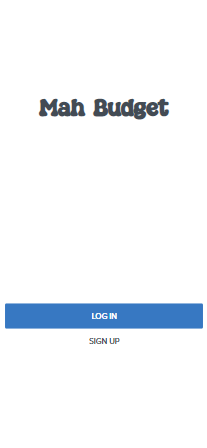
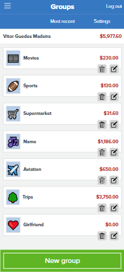
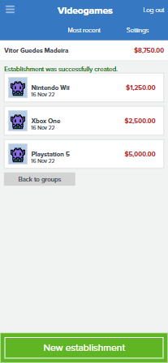
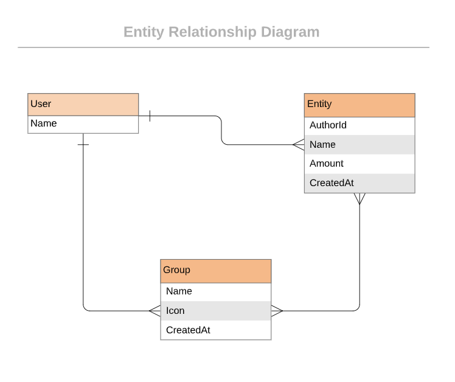

 

# Mah Budget App

Mainly designed as a mobile application where the user can create new accounts, sign in, create different groups and check his spends by checking the establishments/transactions he's done in the past. This is a great Ruby on Rails app to help you track your money outgoings!

# Mah Budget App

Feel welcome to the [live version](https://budget-app-xrna.onrender.com/groups) demo

# Quick view

## Getting Started

- Check the Ruby version or if you have at all by running `ruby -v` if you get something like this `ruby 2.6.8p205 (2021-07-07 revision 67951)` you have Ruby installed.
- Clone the repository by runiing `git clone https://github.com/VitorGuedesMadeira/Budget-App.git` in your CLI.
- `cd Budget-App`
- Run `bundle install`
- Run `rails db:create db:migrate`
- Run `rails server`
- Open Browser `http://localhost:3000/`

## Testing

- Run `rspec spec/`

## Author

👤 **Vitor Guedes Madeira** 🧑🏻‍💻
- GitHub: [@vitorguedesmadeira](https://github.com/VitorGuedesMadeira)
- Twitter: [@CDahguedes](https://twitter.com/CDahguedes)
- LinkedIn: [Vitor Guedes](https://www.linkedin.com/in/vitor-guedes-madeira/)

## 🤝 Contributing

Contributions, issues, and feature requests are welcome!
Feel free to check the [issues page](https://github.com/VitorGuedesMadeira/Budget-App/issues).

## Show your support

Give a ⭐️ if you like this project!

## Design Template

- I give credit to [Gregoire Vella on Behance](https://www.behance.net/gregoirevella) the author of the [original design](https://www.behance.net/gallery/19759151/Snapscan-iOs-design-and-branding?tracking_source=)

## 📝 License

This project is [MIT](./MIT.md) licensed.

## Class diagram for the Database

